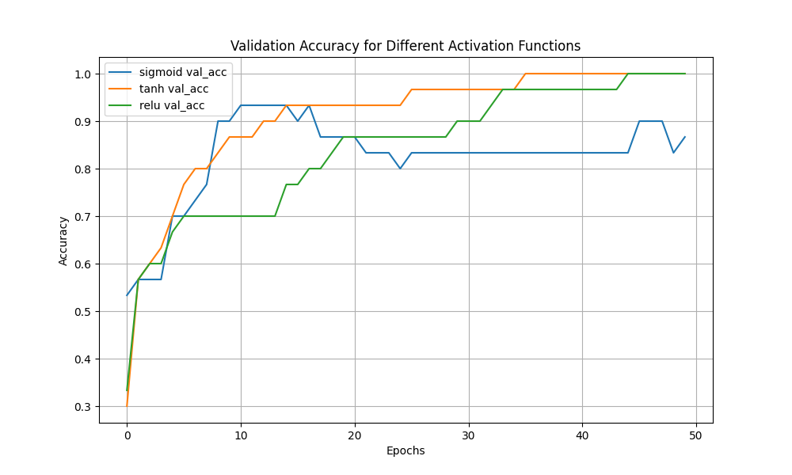
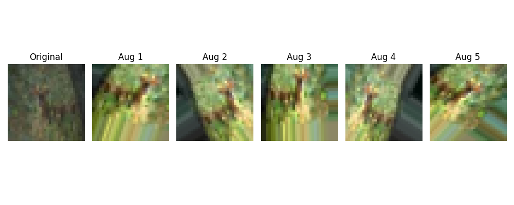

# Deep Learning Lab Programs

This repository contains 10 Python programs based on the Deep Learning Lab Manual.

## Experiments Overview

| Exp | Description |
| :--- | :--- |
| 1 | ANN with Backpropagation (varying activation functions) |
| 2 | Deep Feed Forward ANN (>=4 hidden layers) |
| 3 | Image Classification (Deep FFNN) on MNIST/CIFAR-10 |
| 4 | CNN (2 Conv Layers) on MNIST/CIFAR-10 |
| 5 | Data Augmentation Demo |
| 6 | CNN with Data Augmentation |
| 7 | LeNet-5 Architecture |
| 8 | VGG-16 & 19 Architecture |
| 9 | RNN for Sentiment Analysis |
| 10 | Bidirectional LSTM for Sentiment Analysis |

---

## Detailed Results

### EXP1: ANN with Backpropagation
*   **Goal**: Build an ANN, vary activation functions, and compare results.
*   **Code**: [exp1_ann_backprop.py](exp1_ann_backprop.py)
*   **Outputs**:
    *   📄 [Execution Log](exp1_output.txt)
    *   📊 **Result Plot**:
        
        

---

### EXP2: Deep Feed Forward ANN
*   **Goal**: Build a Deep ANN with >=4 hidden layers.
*   **Code**: [exp2_deep_ann.py](exp2_deep_ann.py)
*   **Outputs**:
    *   📄 [Execution Log](exp2_output.txt)
    *   📊 **Result Plot**:

        

---

### EXP3: Image Classification (Deep FFNN)
*   **Goal**: Classify MNIST/CIFAR-10 using a Deep Feed Forward NN.
*   **Code**: [exp3_image_classification_ann.py](exp3_image_classification_ann.py)
*   **Outputs**:
    *   📄 [Execution Log](exp3_output.txt)
    *   📊 **Result Plot**:

        

---

### EXP4: CNN (2 Conv Layers)
*   **Goal**: Classify MNIST/CIFAR-10 using a simple CNN.
*   **Code**: [exp4_cnn_basic.py](exp4_cnn_basic.py)
*   **Outputs**:
    *   📄 [Execution Log](exp4_output.txt)
    *   📊 **Result Plot**:

        

---

### EXP5: Data Augmentation
*   **Goal**: Demonstrate data augmentation techniques.
*   **Code**: [exp5_data_augmentation.py](exp5_data_augmentation.py)
*   **Outputs**:
    *   📄 [Execution Log](exp5_output.txt)
    *   🖼️ **Augmentation Demo**:

        

---

### EXP6: CNN with Data Augmentation
*   **Goal**: Train a CNN on CIFAR-10 with data augmentation.
*   **Code**: [exp6_cnn_augmentation.py](exp6_cnn_augmentation.py)
*   **Outputs**:
    *   📄 [Execution Log](exp6_output.txt)
    *   📊 **Result Plot**:

        

---

### EXP7: LeNet-5 Architecture
*   **Goal**: Implement LeNet-5 on Fashion MNIST.
*   **Code**: [exp7_lenet5.py](exp7_lenet5.py)
*   **Outputs**:
    *   📄 [Execution Log](exp7_output.txt)
    *   📊 **Result Plot**:

        

---

### EXP8: VGG-16 & 19 Architecture
*   **Goal**: Implement VGG-16/19 on CIFAR-10.
*   **Code**: [exp8_vgg.py](exp8_vgg.py)
*   **Outputs**:
    *   📄 [Execution Log](exp8_output.txt)
    *   📊 **Result Plot**:

        

---

### EXP9: RNN for Sentiment Analysis
*   **Goal**: Sentiment analysis on Movie Reviews using SimpleRNN.
*   **Code**: [exp9_rnn_sentiment.py](exp9_rnn_sentiment.py)
*   **Outputs**:
    *   📄 [Execution Log](exp9_output.txt)
    *   📊 **Result Plot**:

        

---

### EXP10: Bidirectional LSTM
*   **Goal**: Sentiment analysis using Bidirectional LSTM.
*   **Code**: [exp10_bi_lstm_sentiment.py](exp10_bi_lstm_sentiment.py)
*   **Outputs**:
    *   📄 [Execution Log](exp10_output.txt)
    *   📊 **Result Plot**:

        

---

## Operations

**Installation:**
```bash
pip install -r requirements.txt
```

**Run Experiments:**
```powershell
.\run_experiments.ps1
```
